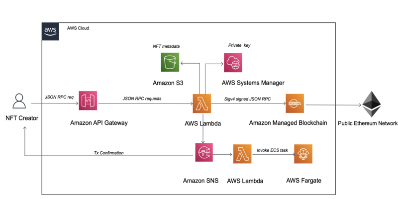
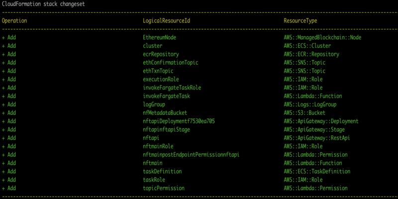

## Deploy NFT on Ethereum using Amazon Managed Blockchain

This repository contains sample code to deploy ERC-721 smart contracts on the Ethereum blockchain network using Amazon Managed Blockchain as a geth node. It provides a reference architecture for deploying a contract, minting NFT tokens and querying token owners using serverless components

The repo is structured as follows:

````bash
.
├── CODE_OF_CONDUCT.md
├── CONTRIBUTING.md
├── LICENSE
├── README.md
├── images
└── serverless

   ````
   
## Reference architecture 



### Pre-requisites

1.	An AWS account with a VPC and a public subnet
2.	AWS SAM CLI : Install the AWS SAM CLI.
3.	Node.js: Install Node.js 14, including the npm package management tool.
4.	Docker: Install Docker community edition.
5.      Ensure you have permissions to make objects in the S3 bucket public
    
### Deploy Ethereum node and Serverless components

An AWS Serverless Application Model (SAM) template is used to deploy the stack

````bash

cd serverless/

sam build

....
Building codeuri: /Users/pravincv/Nft-amb-repo/serverless/lambdas/nftmain runtime: nodejs14.x metadata: {} architecture: x86_64 functions: ['nftmain']
Running NodejsNpmBuilder:NpmPack
Running NodejsNpmBuilder:CopyNpmrc
Running NodejsNpmBuilder:CopySource
Running NodejsNpmBuilder:NpmInstall
Running NodejsNpmBuilder:CleanUpNpmrc

Build Succeeded

```` 

On success completion of the build, deploy the stack 

````bash

sam deploy --guided --capabilities CAPABILITY_NAMED_IAM
````

Input the parameter values and confirm changes to deploy

	Stack Name [nft-stack]:       
	AWS Region [ap-southeast-1]:   -  region where Amazon  Managed Blockchain is supported
	Parameter pEmail [name@example.com]:  - email id that will receive Amazon SNS notifications 
	Parameter pSubnetId [subnet-xxxxxxx]:  - public subnet where the AWS Fargate task will run
	Parameter pNftBucketName [nftmetadata]: - bucket where NFT metadata will be stored
	Parameter pConfirmationBlocks [50]:     - number of confirmations on the blockchain, to wait for
	Parameter pClusterName [nftcluster]:    -  AWS ECS cluster name
	Parameter pContainerName [rinkeby]:     -  name of container
	Parameter pRepositoryName [nftrepository]: - AWS ECR where the Docker images will be stored
	Parameter pIpRangeWhitelist [**.***.***.**/**]:  - IP address CIDR that is allowed to invoke the API
	Parameter pNetworkId [n-ethereum-rinkeby]:      - default network is rinkeby. Can choose ropsten if desired
	Parameter pInstanceType [bc.t3.large]:         - choose desired instance size
	Parameter pAvailabilityZone [ap-southeast-1a]: - choose availability zone based on region
      	Confirm changes before deploy [Y/n]:           - confirm changes Y
	#SAM needs permission to be able to create roles to connect to the resources in your template
	Allow SAM CLI IAM role creation [Y/n]:    - choose Y
	Save arguments to configuration file [Y/n]: -choose Y
	SAM configuration file [samconfig.toml]:  - default file to save the samconfig
	SAM configuration environment [default]:   


The following resources are created on deployment




This creates the following resources

* nftmain  -  AWS Lambda function that provides APIs to  deploy an ERC-721 contract to the Ethereum  rinkeby test network, mint a new token as well get the owner of a specified token minted. The deploy API sends out an SNS message on successful deployment of a contract
 * invokeFargateTask   - This Lambda function  is triggered by the AWS SNS message sent by the nftmain Lambda. On being triggered, it invokes a  task that awaits until the rinkeby blockchain has confirmed the deployment _confirmationBlocks_ (passed as an environment variable)  number of times
 * ethTxnTopic -  Amazon SNS topic to which nftmain Lambda published the transaction id on deployment of a contract 
 * ethConfirmationTopic  - Amazon SNS topic to which the  task publishes a message on completing  _confirmationBlocks_ number of confirmations on the Rinkeby network
 * cluster and taskDefinition -  cluster and task definition that provides the compute for the 'confirmation' logic
 * nftapi - api created and exposed via the  api gateway for users to invoke  HTTP POST 
 * ecrRepository - repository where the docker image for the  task is stored


To complete the serverless stack, create a Docker image and push to the _ecrRepository_ by building, tagging and pushing the image as below.

````bash
cd serverless/

1. aws ecr get-login-password --region <region> | docker login --username AWS --password-stdin <account id>.dkr.ecr.<region>.amazonaws.com
    
2. docker build -t nftrepository .

3. docker tag nftrepository:latest <account>.dkr.ecr.<region><.amazonaws.com/nftrepository:latest

4. docker push <account>.dkr.ecr.<region>.amazonaws.com/nftrepository:latest
    
    
  ````

To create a transaction on the Ethereum Rinkeby network, a private-public key pair is required. Generate the private key and upload to AWS SSM Parameter Store  as an encrypted string as 'ethSystemKey'. - ensure the string excludes the first 2 characters, 0x of the privatekey . Add some ethereum test tokens for the rinkeby network by entering the public key https://faucets.chain.link/rinkeby  and requesting ethereum test tokens. Please note that for AWS SSM Paramter Store might not be sufficient for some cases where wallets bear real funds.


## Deploying a test contract, minting an NFT and checking token ownership

Now we are ready to deploy an ERC-721 smart contract to the network.

```` bash


├── nftmain
│   ├── NFTSamples
│   │   ├── build
│   │   │   └── NFT_BaseURI.json
│   │   └── contracts
│   │       ├── NFTSample.sol
│   │       └── NFT_BaseURI.sol
│   ├── aws-web3-http-provider.js
│   ├── deploy_contract.js
│   ├── get_owner.js
│   ├── index.js
│   ├── mint_nft.js
│   ├── package-lock.json
    ├── package.json
    └── utils.js
    
└── txconfirmation
    └── index.js
    
   ````
   The contract to be deployed  is stored in the nftmain directory under NFTSamples.
   
  We'll be using curl -X POST to deploy and mint the NFT. Obtain the API endpoint i.e InvokeURL from  Amazon API Gateway ->APIs > Stages on the AWS Console.
   
   ````bash
 
cd serverless/test-events 

serverless/test-events
├── deploy.json
├── getowner.json
└── mint.json
 ````
Edit the deploy.json file to fill up the needed values.

```` bash
> cat deploy.json

{"requestType": "deploy",
"tokenName": "coolnft",  # name of nft
"tokenTicker": "SYMB",   # symbol
"metadataFilename": "metadata.json", # name of metadata file
 "metadata":{                #metadata associated with nft
  "description": "useful description",     
  "image": "<url of the image, preferably an IPFS hash>",
  "name": " coolnft"
}}
> curl -X POST https://<api> .execute-api.<region>.amazonaws.com/nftapi -H "Content-Type: application/json" -d @deploy.json
````

The deploy command returns a transaction id hash  and the contract address.

````bash
{"Transaction id":"0x6b2af81c34055b678e5a8ae401f508fcbf950341df7e55e7372e80f75faf8afc","ContractAddress":"0x8A3Ce65B266E8DE37Fe7d2e4911CA4578B5a7445"
   

 > cat mint.json
 
 {"requestType": "mint",
"contractAddress": "0x8A3Ce65B266E8DE37Fe7d2e4911CA4578B5a7445",   -> address of the contract address of the deployed contract
"mintAddress": "0x905b8699E611a5F1f74BF5Cc3cCa2aCd175ec0c0"        -> public key of any another wallet/address
}
 
 > curl -X POST https://<api>.execute-api.<region>.amazonaws.com/nftapi -H "Content-Type: application/json" -d @mint.json
```` 
 The response contains the transaction id  ash

````bash 
{"Mint Tx Hash":"0x960080892462ea76a90a5a00fe88ebc5d85d0b84d75e781ca5aa14e5829a0a14"}
 > cat getowner.json
 {"requestType": "mint",
"contractAddress": "0x8A3Ce65B266E8DE37Fe7d2e4911CA4578B5a7445",   -> address of the contract address of the deployed contract
"tokenID": "0"        -> ID of the token that was minted previously
}

> curl -X POST https://<api>.<region>.amazonaws.com/nftapi -H "Content-Type: application/json" -d @getowner.json
````
The response provides the address of the owner for whom the token was minted.
````bash
{"Owner address":"0x905b8699E611a5F1f74BF5Cc3cCa2aCd175ec0c0"}
````

## Security

See [CONTRIBUTING](CONTRIBUTING.md#security-issue-notifications) for more information.

## License

This library is licensed under the MIT-0 License. See the LICENSE file.

